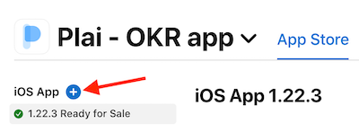

# Intro
This page will guide you through the steps to build and deploy the application.
For all next steps, we will assume, that you have a project, configured like in the [Deployment Pipeline](deployment-pipeline.md) section.
Before moving to deployment, test all your changes on both platforms.

# Development Build
Dev builds produced from all branches, except master.
A typical workflow will be:
1) Bump up the App version in fastlane/.env.{flavor} files;
2) Push the latest updates to your branch;
3) Run builds for Android & iOS in CircleCI;
4) After successfully build in CircleCI, create PR from your branch into development;
5) Describe main things in PR comment to help reviewers quickly hop into understanding the changes;
6) Write "Test Details" to your dev builds in AppStoreConnect / AppCenter / GooglePlay.
   It can be some checklist to make tester life easier;

If you successfully pass all these steps above, testers don't find bugs, and PR was approved - then you can proceed to the production build.

# Production Build
Prod builds produced only from master.
0) Check, that you don't forget to bump up the App version.
1) Merge your PR into development branch.
2) Merge development into the Master.
3) Run builds for Android & iOS in CircleCI;

After this, you can move on to release management.

# Release Management
### iOS

1) Click on this button to start creating a new release version.

2) In "Store Version Number" enter the new version (which you entered in the first step of the "Development Build" Section)
3) Fill in the "What's New in This Version", check that screenshots are still actual, and select "Build" with a proper build number.
4) Proceed to publish the App.

### Android

1) Go to the Testing > Internal testing
2) Click on "View release details" on the proper app version
3) Add "Release notes" here.
4) Return to the previous page and select Promote release > Production
5) Proceed to publish the App.
